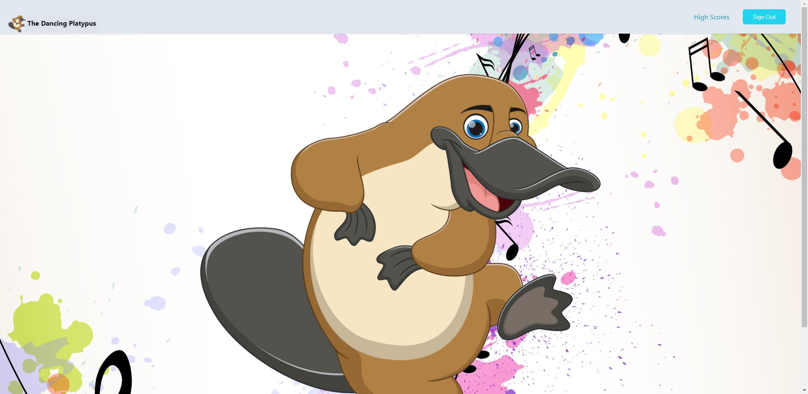

# The Dancing Platypus

This application will help keep children entertained so their parents can work on getting work done. The core concept of the game is that you have one minute after you start clicking, to get as many clicks as possible.

## Website

[The Dancing Platypus](http://mighty-plateau-48959.herokuapp.com/)

## Screenshot



## Installation 
- You will need to install necessary dependencies by running the following command in your terminal

```bash
  npm i
```

## Technologies Used
* Node
* Handlebars
*MySQL
* Express
* Express-session
* bcrypt
* Sequelize
* Tailwind CSS

## Contributors
* John Yoder
* Bradley Boyd
* Damaris Palacios
* Brian Casillas
